```mermaid
graph TB
    subgraph "Root Module (main.tf)"
        ROOT[main.tf]
    end
    
    subgraph "VPC Module"
        VPC[aws_vpc.main]
        IGW[aws_internet_gateway.main]
        PUB_SUB[aws_subnet.public x3]
        PRIV_SUB[aws_subnet.private x3]
        NAT[aws_nat_gateway x3]
        EIP[aws_eip x3]
        PUB_RT[aws_route_table.public]
        PRIV_RT[aws_route_table.private x3]
        RT_ASSOC[aws_route_table_association]
    end
    
    subgraph "EKS Module"
        EKS_CLUSTER[aws_eks_cluster.main]
        EKS_NODES[aws_eks_node_group.main]
        EKS_ROLE[aws_iam_role.eks_cluster_role]
        NODE_ROLE[aws_iam_role.eks_node_group_role]
        
        subgraph "EKS Add-ons"
            ADDON_EBS[aws_eks_addon.ebs_csi_driver]
            ADDON_CNI[aws_eks_addon.vpc_cni]
            ADDON_DNS[aws_eks_addon.coredns]
            ADDON_PROXY[aws_eks_addon.kube_proxy]
            ADDON_POD[aws_eks_addon.pod_identity]
        end
        
        subgraph "ALB Controller"
            ALB_ROLE[aws_iam_role.aws_load_balancer_controller]
            ALB_POLICY[aws_iam_policy.aws_load_balancer_controller]
            ALB_HELM[helm_release.aws_load_balancer_controller]
        end
    end
    
    subgraph "Bastion Module (Optional)"
        BASTION_SUB[aws_subnet.bastion]
        BASTION_SG[aws_security_group.bastion]
        BASTION_EC2[aws_instance.bastion]
    end
    
    %% Dependencies
    ROOT --> VPC
    ROOT --> EKS_CLUSTER
    ROOT --> BASTION_EC2
    
    VPC --> IGW
    VPC --> PUB_SUB
    VPC --> PRIV_SUB
    EIP --> NAT
    PUB_SUB --> NAT
    IGW --> PUB_RT
    NAT --> PRIV_RT
    PUB_SUB --> RT_ASSOC
    PRIV_SUB --> RT_ASSOC
    
    VPC --> EKS_CLUSTER
    PUB_SUB --> EKS_CLUSTER
    PRIV_SUB --> EKS_CLUSTER
    EKS_ROLE --> EKS_CLUSTER
    
    EKS_CLUSTER --> EKS_NODES
    PRIV_SUB --> EKS_NODES
    NODE_ROLE --> EKS_NODES
    
    EKS_CLUSTER --> ADDON_EBS
    EKS_CLUSTER --> ADDON_CNI
    EKS_CLUSTER --> ADDON_DNS
    EKS_CLUSTER --> ADDON_PROXY
    EKS_CLUSTER --> ADDON_POD
    
    ALB_ROLE --> ALB_HELM
    ALB_POLICY --> ALB_ROLE
    EKS_CLUSTER --> ALB_HELM
    
    VPC --> BASTION_SUB
    VPC --> BASTION_SG
    BASTION_SUB --> BASTION_EC2
    BASTION_SG --> BASTION_EC2
```

# AWS EKS Terraform Infrastructure

这个 Terraform 配置创建了一个完整的 AWS EKS 基础设施，包括 VPC、EKS 集群、跳板机和相关组件。

## 🏗️ 架构概览

```
┌─────────────────────────────────────────────────────────────────────────────────────┐
│                                AWS Account                                          │
│  ┌─────────────────────────────────────────────────────────────────────────────────┐ │
│  │                            VPC (10.0.0.0/16)                                   │ │
│  │                                                                                 │ │
│  │  ┌─────────────────┐  ┌─────────────────┐  ┌─────────────────┐                 │ │
│  │  │   AZ us-west-2a │  │   AZ us-west-2b │  │   AZ us-west-2c │                 │ │
│  │  │                 │  │                 │  │                 │                 │ │
│  │  │ ┌─────────────┐ │  │ ┌─────────────┐ │  │ ┌─────────────┐ │                 │ │
│  │  │ │Public Subnet│ │  │ │Public Subnet│ │  │ │Public Subnet│ │                 │ │
│  │  │ │10.0.0.0/24  │ │  │ │10.0.1.0/24  │ │  │ │10.0.2.0/24  │ │                 │ │
│  │  │ │             │ │  │ │             │ │  │ │             │ │                 │ │
│  │  │ │ ┌─────────┐ │ │  │ │ ┌─────────┐ │ │  │ │ ┌─────────┐ │ │                 │ │
│  │  │ │ │NAT GW   │ │ │  │ │ │NAT GW   │ │ │  │ │ │NAT GW   │ │ │                 │ │
│  │  │ │ └─────────┘ │ │  │ │ └─────────┘ │ │  │ │ └─────────┘ │ │                 │ │
│  │  │ └─────────────┘ │  │ └─────────────┘ │  │ └─────────────┘ │                 │ │
│  │  │                 │  │                 │  │                 │                 │ │
│  │  │ ┌─────────────┐ │  │ ┌─────────────┐ │  │ ┌─────────────┐ │                 │ │
│  │  │ │Private      │ │  │ │Private      │ │  │ │Private      │ │                 │ │
│  │  │ │Subnet       │ │  │ │Subnet       │ │  │ │Subnet       │ │                 │ │
│  │  │ │10.0.3.0/24  │ │  │ │10.0.4.0/24  │ │  │ │10.0.5.0/24  │ │                 │ │
│  │  │ │             │ │  │ │             │ │  │ │             │ │                 │ │
│  │  │ │┌───────────┐│ │  │ │┌───────────┐│ │  │ │┌───────────┐│ │                 │ │
│  │  │ ││EKS Worker ││ │  │ ││Available  ││ │  │ ││EKS Worker ││ │                 │ │
│  │  │ ││Node       ││ │  │ ││for Scale  ││ │  │ ││Node       ││ │                 │ │
│  │  │ ││(Active)   ││ │  │ ││           ││ │  │ ││(Active)   ││ │                 │ │
│  │  │ │└───────────┘│ │  │ │└───────────┘│ │  │ │└───────────┘│ │                 │ │
│  │  │ └─────────────┘ │  │ └─────────────┘ │  │ └─────────────┘ │                 │ │
│  │  └─────────────────┘  └─────────────────┘  └─────────────────┘                 │ │
│  │                                                                                 │ │
│  │  ┌─────────────────────────────────────────────────────────────────────────────┐ │ │
│  │  │                        Bastion Subnet (10.0.100.0/24)                     │ │ │
│  │  │                              ┌─────────────┐                               │ │ │
│  │  │                              │   Bastion   │                               │ │ │
│  │  │                              │    Host     │                               │ │ │
│  │  │                              │ (Optional)  │                               │ │ │
│  │  │                              └─────────────┘                               │ │ │
│  │  └─────────────────────────────────────────────────────────────────────────────┘ │ │
│  │                                                                                 │ │
│  │  ┌─────────────────────────────────────────────────────────────────────────────┐ │ │
│  │  │                            EKS Control Plane                               │ │ │
│  │  │                          (AWS Managed Service)                             │ │ │
│  │  └─────────────────────────────────────────────────────────────────────────────┘ │ │
│  └─────────────────────────────────────────────────────────────────────────────────┘ │
│                                                                                     │
│  ┌─────────────────────────────────────────────────────────────────────────────────┐ │
│  │                              Internet Gateway                                  │ │
│  └─────────────────────────────────────────────────────────────────────────────────┘ │
└─────────────────────────────────────────────────────────────────────────────────────┘
```

## 📦 模块架构

### 模块依赖关系图

```
┌─────────────┐
│   main.tf   │
│ (Root Module)│
└──────┬──────┘
       │
       ├─────────────────────────────────────────────────────────┐
       │                                                         │
       ▼                                                         ▼
┌─────────────┐                                           ┌─────────────┐
│VPC Module   │                                           │EKS Module   │
│             │──────────────────────────────────────────▶│             │
│- VPC        │         vpc_id, subnet_ids                │- EKS Cluster│
│- Subnets    │                                           │- Node Groups│
│- IGW        │                                           │- Add-ons    │
│- NAT GW     │                                           │- IAM Roles  │
│- Route Tables│                                          │- Security   │
└─────────────┘                                           └─────────────┘
       │                                                         ▲
       │ vpc_id, route_table_id                                  │
       ▼                                                         │
┌─────────────┐                                                 │
│Bastion Module│                                                │
│(Optional)   │                                                 │
│             │─────────────────────────────────────────────────┘
│- EC2 Instance│         bastion_security_group_id
│- Security Group│
│- Subnet     │
└─────────────┘
```

## 🔗 Terraform 资源关系图

### 详细资源依赖关系



### 资源数量统计

| 模块 | 资源类型 | 数量 | 说明 |
|------|----------|------|------|
| **VPC** | aws_vpc | 1 | 主 VPC |
| | aws_internet_gateway | 1 | 互联网网关 |
| | aws_subnet (public) | 3 | 每个 AZ 一个公有子网 |
| | aws_subnet (private) | 3 | 每个 AZ 一个私有子网 |
| | aws_nat_gateway | 3 | 每个 AZ 一个 NAT 网关 |
| | aws_eip | 3 | NAT 网关弹性 IP |
| | aws_route_table | 4 | 1个公有 + 3个私有路由表 |
| | aws_route | 6+ | 路由规则 |
| | aws_route_table_association | 6 | 子网路由表关联 |
| **EKS** | aws_eks_cluster | 1 | EKS 控制平面 |
| | aws_eks_node_group | 1 | 工作节点组 |
| | aws_iam_role | 3 | 集群角色 + 节点角色 + ALB 角色 |
| | aws_iam_policy | 1 | ALB Controller 策略 |
| | aws_iam_role_policy_attachment | 6+ | 策略附加 |
| | aws_eks_addon | 5 | EKS 插件 |
| | aws_eks_access_entry | 1+ | 访问配置 |
| | helm_release | 1 | ALB Controller |
| **Bastion** | aws_subnet | 1 | 跳板机子网 |
| | aws_security_group | 1 | 跳板机安全组 |
| | aws_instance | 1 | 跳板机实例 |
| | aws_route_table_association | 1 | 路由表关联 |

### 模块间数据流

```
┌─────────────┐    vpc_id, subnet_ids    ┌─────────────┐
│             │ ────────────────────────▶│             │
│ VPC Module  │                          │ EKS Module  │
│             │◀────────────────────────│             │
└─────────────┘   security_group_id     └─────────────┘
       │                                       ▲
       │ vpc_id                                │
       │ route_table_id                       │ bastion_sg_id
       ▼                                      │
┌─────────────┐                              │
│             │──────────────────────────────┘
│Bastion Module│
│             │
└─────────────┘
```

**数据传递说明：**

1. **VPC → EKS**:
   - `vpc_id`: EKS 集群和节点组使用
   - `public_subnet_ids`: EKS 控制平面使用
   - `private_subnet_ids`: EKS 工作节点使用

2. **VPC → Bastion**:
   - `vpc_id`: 创建跳板机子网和安全组
   - `public_route_table_id`: 跳板机子网路由

3. **Bastion → EKS**:
   - `bastion_security_group_id`: EKS 节点安全组规则

## 🎯 高可用性设计

### 跨可用区分布
```
可用区分布策略：
├── us-west-2a
│   ├── 公有子网 (10.0.0.0/24) + NAT Gateway
│   ├── 私有子网 (10.0.3.0/24) + EKS Node
│   └── 可用 IP: 218/256
├── us-west-2b  
│   ├── 公有子网 (10.0.1.0/24) + NAT Gateway
│   ├── 私有子网 (10.0.4.0/24) + 扩展预留
│   └── 可用 IP: 251/256
└── us-west-2c
    ├── 公有子网 (10.0.2.0/24) + NAT Gateway
    ├── 私有子网 (10.0.5.0/24) + EKS Node
    └── 可用 IP: 233/256
```

### 故障恢复能力
- **NAT 网关**: 每个 AZ 独立，单点故障不影响其他 AZ
- **EKS 节点**: 分布在多个 AZ，支持自动扩展
- **EKS 控制平面**: AWS 托管，多 AZ 高可用
- **存储**: EBS 卷自动备份，支持跨 AZ 故障转移

## 📤 Terraform Outputs

### 根模块输出 (Root Module Outputs)

部署完成后，Terraform 会输出以下重要信息：

#### VPC 相关输出
```hcl
# 网络基础设施
vpc_id                = "vpc-xxxxxxxxx"           # VPC ID
vpc_cidr_block        = "10.0.0.0/16"            # VPC CIDR 块
internet_gateway_id   = "igw-xxxxxxxxx"          # 互联网网关 ID
nat_gateway_ids       = [                        # NAT 网关 ID 列表
  "nat-xxxxxxxxx",    # us-west-2a
  "nat-xxxxxxxxx",    # us-west-2b  
  "nat-xxxxxxxxx"     # us-west-2c
]

# 子网信息
public_subnet_ids     = [                        # 公有子网 ID 列表
  "subnet-xxxxxxxxx", # us-west-2a (10.0.0.0/24)
  "subnet-xxxxxxxxx", # us-west-2b (10.0.1.0/24)
  "subnet-xxxxxxxxx"  # us-west-2c (10.0.2.0/24)
]
private_subnet_ids    = [                        # 私有子网 ID 列表
  "subnet-xxxxxxxxx", # us-west-2a (10.0.3.0/24)
  "subnet-xxxxxxxxx", # us-west-2b (10.0.4.0/24)
  "subnet-xxxxxxxxx"  # us-west-2c (10.0.5.0/24)
]

# 可用区信息
availability_zones    = [                        # 使用的可用区列表
  "us-west-2a",
  "us-west-2b", 
  "us-west-2c"
]
```

#### EKS 集群输出
```hcl
# 集群基本信息
eks_cluster_id        = "my-project-eks-cluster" # 集群 ID
eks_cluster_name      = "my-project-eks-cluster" # 集群名称
eks_cluster_arn       = "arn:aws:eks:us-west-2:..." # 集群 ARN
eks_cluster_endpoint  = "https://xxxxx.gr7.us-west-2.eks.amazonaws.com" # API 端点
eks_cluster_version   = "1.33"                   # Kubernetes 版本

# 连接命令
eks_kubeconfig_command = "aws eks update-kubeconfig --region us-west-2 --name my-project-eks-cluster"
```

#### Bastion 主机输出 (可选)
```hcl
# Bastion 实例信息
bastion_instance_id   = "i-xxxxxxxxx"            # 实例 ID
bastion_public_ip     = "xx.xx.xx.xx"           # 公有 IP
bastion_private_ip    = "10.0.100.xx"           # 私有 IP
bastion_ssh_command   = "ssh -i ~/.ssh/key.pem ec2-user@xx.xx.xx.xx" # SSH 连接命令
```

### 模块内部输出 (Module Internal Outputs)

#### VPC 模块额外输出
```hcl
# 子网 CIDR 信息
public_subnet_cidrs   = ["10.0.0.0/24", "10.0.1.0/24", "10.0.2.0/24"]
private_subnet_cidrs  = ["10.0.3.0/24", "10.0.4.0/24", "10.0.5.0/24"]

# 路由表信息
public_route_table_id = "rtb-xxxxxxxxx"          # 公有路由表 ID
private_route_table_ids = [                      # 私有路由表 ID 列表
  "rtb-xxxxxxxxx",    # us-west-2a
  "rtb-xxxxxxxxx",    # us-west-2b
  "rtb-xxxxxxxxx"     # us-west-2c
]
```

#### EKS 模块详细输出
```hcl
# 集群详细信息
cluster_platform_version = "eks.x"               # EKS 平台版本
cluster_status           = "ACTIVE"              # 集群状态
oidc_issuer_url         = "https://oidc.eks.us-west-2.amazonaws.com/id/xxxxx"

# 安全组信息
cluster_security_group_id = "sg-xxxxxxxxx"      # 集群安全组 ID
node_security_group_id   = "sg-xxxxxxxxx"       # 节点安全组 ID

# IAM 角色信息
cluster_iam_role_arn     = "arn:aws:iam::xxx:role/my-project-eks-cluster-role"
node_group_iam_role_arn  = "arn:aws:iam::xxx:role/my-project-eks-node-group-role"
aws_load_balancer_controller_role_arn = "arn:aws:iam::xxx:role/my-project-aws-load-balancer-controller"
ebs_csi_driver_role_arn  = "arn:aws:iam::xxx:role/my-project-ebs-csi-driver"
vpc_cni_role_arn        = "arn:aws:iam::xxx:role/my-project-vpc-cni"

# EKS 插件信息
eks_addons = {
  pod_identity = {
    name    = "eks-pod-identity-agent"
    version = "v1.x.x-eksbuild.x"
  }
  ebs_csi_driver = {
    name    = "aws-ebs-csi-driver"
    version = "v1.x.x-eksbuild.x"
  }
  coredns = {
    name    = "coredns"
    version = "v1.x.x-eksbuild.x"
  }
  kube_proxy = {
    name    = "kube-proxy"
    version = "v1.x.x-eksbuild.x"
  }
  vpc_cni = {
    name    = "vpc-cni"
    version = "v1.x.x-eksbuild.x"
  }
}

# 访问配置信息
cluster_access_entries = {
  cluster_creator = "arn:aws:iam::xxx:user/username"
  admin_users     = []
  admin_roles     = []
}

# 当前调用者身份
current_caller_identity = {
  account_id = "123456789012"
  arn        = "arn:aws:iam::xxx:user/username"
  user_id    = "AIDAXXXXXXXXXXXXX"
}

# 集群认证信息 (敏感)
cluster_certificate_authority_data = "LS0tLS1CRUdJTi..." # Base64 编码的 CA 证书
cluster_auth_token                = "k8s-aws-v1.xxx"    # 认证令牌 (敏感)
```

#### Bastion 模块详细输出
```hcl
# 网络信息
bastion_subnet_id        = "subnet-xxxxxxxxx"    # Bastion 子网 ID
bastion_security_group_id = "sg-xxxxxxxxx"       # Bastion 安全组 ID

# IAM 信息
bastion_iam_role_arn     = "arn:aws:iam::xxx:role/my-project-bastion-role"
```

### 输出使用示例

#### 获取所有输出
```bash
terraform output
```

#### 获取特定输出
```bash
# 获取 VPC ID
terraform output vpc_id

# 获取 EKS 集群端点
terraform output eks_cluster_endpoint

# 获取 kubeconfig 命令
terraform output eks_kubeconfig_command

# 获取 Bastion SSH 命令
terraform output bastion_ssh_command
```

#### 在其他 Terraform 配置中引用
```hcl
# 在其他 Terraform 配置中引用这些输出
data "terraform_remote_state" "eks" {
  backend = "local" # 或其他后端
  config = {
    path = "../path/to/terraform.tfstate"
  }
}

# 使用输出值
resource "aws_security_group_rule" "example" {
  security_group_id = data.terraform_remote_state.eks.outputs.cluster_security_group_id
  # ...
}
```

#### JSON 格式输出
```bash
# 获取 JSON 格式的所有输出
terraform output -json

# 获取特定输出的 JSON 格式
terraform output -json vpc_id
```

### 输出分类说明

| 类别 | 输出数量 | 用途 |
|------|----------|------|
| **网络基础** | 8个 | VPC、子网、网关等网络资源 ID |
| **EKS 集群** | 6个 | 集群基本信息和连接配置 |
| **Bastion 主机** | 4个 | 跳板机访问信息（可选） |
| **安全和权限** | 10+个 | IAM 角色、安全组、访问配置 |
| **插件和服务** | 5个 | EKS 插件版本和状态信息 |
| **运维工具** | 3个 | 连接命令和认证信息 |

这些输出为后续的基础设施管理、应用部署和运维操作提供了必要的信息。

## 文件结构

```
.
├── main.tf                    # 主配置文件
├── variables.tf               # 变量定义
├── outputs.tf                 # 输出定义
├── terraform.tfvars.example   # 变量值示例
├── modules/
│   ├── vpc/
│   │   ├── main.tf           # VPC 模块主配置
│   │   ├── variables.tf      # VPC 模块变量
│   │   └── outputs.tf        # VPC 模块输出
│   ├── eks/
│   │   ├── main.tf           # EKS 集群主配置
│   │   ├── variables.tf      # EKS 模块变量
│   │   ├── outputs.tf        # EKS 模块输出
│   │   ├── addons.tf         # EKS 插件配置
│   │   ├── helm.tf           # Helm Chart 配置 (AWS Load Balancer Controller)
│   │   ├── cleanup.tf        # 清理脚本配置
│   │   └── providers.tf      # Provider 配置
│   └── bastion/ (可选)
│       ├── main.tf           # Bastion 主机配置
│       ├── variables.tf      # Bastion 模块变量
│       └── outputs.tf        # Bastion 模块输出
└── README.md                 # 说明文档
```

## 前置要求

### 1. 安装 Terraform

#### macOS (使用 Homebrew)
```bash
# 安装 Homebrew (如果尚未安装)
/bin/bash -c "$(curl -fsSL https://raw.githubusercontent.com/Homebrew/install/HEAD/install.sh)"

# 安装 Terraform
brew install terraform

# 验证安装
terraform version
```

#### Linux (Ubuntu/Debian)
```bash
# 添加 HashiCorp GPG 密钥
wget -O- https://apt.releases.hashicorp.com/gpg | sudo gpg --dearmor -o /usr/share/keyrings/hashicorp-archive-keyring.gpg

# 添加 HashiCorp 仓库
echo "deb [signed-by=/usr/share/keyrings/hashicorp-archive-keyring.gpg] https://apt.releases.hashicorp.com $(lsb_release -cs) main" | sudo tee /etc/apt/sources.list.d/hashicorp.list

# 更新包列表并安装
sudo apt update && sudo apt install terraform

# 验证安装
terraform version
```

#### Windows
1. 从 [Terraform 官网](https://www.terraform.io/downloads.html) 下载适合的版本
2. 解压到系统 PATH 目录
3. 在命令提示符中运行 `terraform version` 验证

### 2. 配置 AWS 凭证

#### 方法一：使用 AWS CLI (推荐)
```bash
# 安装 AWS CLI
# macOS
brew install awscli

# Linux
sudo apt install awscli

# Windows
# 从 https://aws.amazon.com/cli/ 下载安装

# 配置 AWS 凭证
aws configure
```

配置时需要提供：
- **Access Key ID**: 您的 AWS 访问密钥 ID
- **Secret Access Key**: 您的 AWS 秘密访问密钥
- **Default region**: 默认区域 (如: us-west-2)
- **Default output format**: 输出格式 (推荐: json)

#### 方法二：手动创建凭证文件
创建 `~/.aws/credentials` 文件：
```ini
[default]
aws_access_key_id = YOUR_ACCESS_KEY_ID
aws_secret_access_key = YOUR_SECRET_ACCESS_KEY
```

创建 `~/.aws/config` 文件：
```ini
[default]
region = us-west-2
output = json
```

#### 方法三：使用环境变量
```bash
export AWS_ACCESS_KEY_ID="your-access-key-id"
export AWS_SECRET_ACCESS_KEY="your-secret-access-key"
export AWS_DEFAULT_REGION="us-west-2"
```

### 3. 验证 AWS 凭证
```bash
# 测试 AWS 连接
aws sts get-caller-identity

# 应该返回类似以下的信息：
# {
#     "UserId": "AIDACKCEVSQ6C2EXAMPLE",
#     "Account": "123456789012",
#     "Arn": "arn:aws:iam::123456789012:user/username"
# }
```

### 4. 所需 AWS 权限

确保您的 AWS 用户或角色具有以下权限：
```json
{
    "Version": "2012-10-17",
    "Statement": [
        {
            "Effect": "Allow",
            "Action": [
                "ec2:*",
                "eks:*",
                "iam:*",
                "elasticloadbalancing:*"
            ],
            "Resource": "*"
        }
    ]
}
```

或者使用 AWS 托管策略：
- `AmazonEKSClusterPolicy`
- `AmazonEKSWorkerNodePolicy`
- `AmazonEKS_CNI_Policy`
- `AmazonEC2ContainerRegistryReadOnly`
- `ElasticLoadBalancingFullAccess`

### 5. 安装 Helm

本项目使用 Helm 来部署 AWS Load Balancer Controller，因此需要安装 Helm。

#### macOS (使用 Homebrew)
```bash
# 安装 Helm
brew install helm

# 验证安装
helm version
```

#### Linux (Ubuntu/Debian)
```bash
# 下载并安装 Helm
curl https://baltocdn.com/helm/signing.asc | gpg --dearmor | sudo tee /usr/share/keyrings/helm.gpg > /dev/null
sudo apt-get install apt-transport-https --yes
echo "deb [arch=$(dpkg --print-architecture) signed-by=/usr/share/keyrings/helm.gpg] https://baltocdn.com/helm/stable/debian/ all main" | sudo tee /etc/apt/sources.list.d/helm-stable-debian.list
sudo apt-get update
sudo apt-get install helm

# 验证安装
helm version
```

#### Windows
1. 从 [Helm 官网](https://helm.sh/docs/intro/install/) 下载适合的版本
2. 解压到系统 PATH 目录
3. 在命令提示符中运行 `helm version` 验证

#### 或者使用脚本安装 (Linux/macOS)
```bash
# 使用官方安装脚本
curl -fsSL -o get_helm.sh https://raw.githubusercontent.com/helm/helm/main/scripts/get-helm-3
chmod 700 get_helm.sh
./get_helm.sh

# 验证安装
helm version
```

### 6. 添加 AWS EKS Chart 仓库

安装 Helm 后，需要添加 AWS EKS Chart 仓库：

```bash
# 添加 AWS EKS Chart 仓库
helm repo add eks https://aws.github.io/eks-charts

# 更新仓库
helm repo update

# 验证仓库添加成功
helm repo list
```

### 7. 安装 kubectl (可选但推荐)

虽然不是必需的，但建议安装 kubectl 来管理 EKS 集群：

#### macOS
```bash
# 使用 Homebrew
brew install kubectl

# 或者使用 curl
curl -LO "https://dl.k8s.io/release/$(curl -L -s https://dl.k8s.io/release/stable.txt)/bin/darwin/amd64/kubectl"
chmod +x kubectl
sudo mv kubectl /usr/local/bin/
```

#### Linux
```bash
# 下载最新版本
curl -LO "https://dl.k8s.io/release/$(curl -L -s https://dl.k8s.io/release/stable.txt)/bin/linux/amd64/kubectl"
chmod +x kubectl
sudo mv kubectl /usr/local/bin/

# 验证安装
kubectl version --client
```

#### Windows
1. 从 [Kubernetes 官网](https://kubernetes.io/docs/tasks/tools/install-kubectl-windows/) 下载 kubectl
2. 添加到系统 PATH
3. 运行 `kubectl version --client` 验证

## 使用方法

1. **复制变量文件**:
   ```bash
   cp terraform.tfvars.example terraform.tfvars
   ```

2. **修改变量值** (可选):
   编辑 `terraform.tfvars` 文件来自定义配置

3. **初始化 Terraform**:
   ```bash
   terraform init
   ```

4. **查看执行计划**:
   ```bash
   terraform plan
   ```

5. **应用配置**:
   ```bash
   terraform apply
   ```

6. **确认部署**:
   输入 `yes` 确认创建资源

## 网络配置

### 默认配置
- **VPC CIDR**: 10.0.0.0/16
- **公有子网**: 10.0.0.0/24, 10.0.1.0/24, 10.0.2.0/24
- **私有子网**: 10.0.3.0/24, 10.0.4.0/24, 10.0.5.0/24

### 子网掩码配置

#### 方式一：通过 newbits 参数配置（推荐）

在 `terraform.tfvars` 中设置：

```hcl
# 默认配置 - /24 子网 (256 个 IP)
public_subnet_newbits  = 8
private_subnet_newbits = 8

# 大子网配置 - /22 子网 (1024 个 IP)
public_subnet_newbits  = 6
private_subnet_newbits = 6

# 小子网配置 - /26 子网 (64 个 IP)
public_subnet_newbits  = 10
private_subnet_newbits = 10
```

**常用掩码对照表：**
| newbits | 子网掩码 | 可用 IP 数量 | 适用场景 |
|---------|----------|-------------|----------|
| 6       | /22      | 1024        | 大型应用，需要大量 IP |
| 8       | /24      | 256         | 标准配置，适合大多数场景 |
| 10      | /26      | 64          | 小型应用，节约 IP 地址 |
| 12      | /28      | 16          | 微服务，最小化 IP 使用 |

#### 方式二：完全自定义 CIDR 块

```hcl
# 自定义子网 CIDR
custom_public_subnet_cidrs  = ["10.0.0.0/24", "10.0.1.0/24", "10.0.2.0/24"]
custom_private_subnet_cidrs = ["10.0.10.0/24", "10.0.11.0/24", "10.0.12.0/24"]
```

#### 方式三：混合配置

为公有和私有子网设置不同的掩码：

```hcl
public_subnet_newbits  = 8   # 公有子网使用 /24 (256 IP)
private_subnet_newbits = 6   # 私有子网使用 /22 (1024 IP)
```

## 配置参数

### 基础参数
- `aws_region`: AWS 区域 (默认: us-west-2)
- `project_name`: 项目名称前缀 (默认: my-project)
- `vpc_cidr`: VPC CIDR 块 (默认: 10.0.0.0/16)
- `availability_zone_count`: 可用区数量 (默认: 3)

### 子网配置参数
- `public_subnet_newbits`: 公有子网掩码位数 (默认: 8)
- `private_subnet_newbits`: 私有子网掩码位数 (默认: 8)
- `custom_public_subnet_cidrs`: 自定义公有子网 CIDR 列表 (可选)
- `custom_private_subnet_cidrs`: 自定义私有子网 CIDR 列表 (可选)

### 跳板机配置参数
- `enable_bastion`: 是否启用跳板机 (默认: false)
- `bastion_key_name`: EC2 密钥对名称 (必须指定已存在的密钥)
- `bastion_instance_type`: 实例类型 (默认: t2.micro)
- `bastion_subnet_cidr`: 跳板机子网 CIDR (默认: 10.0.100.0/24)
- `bastion_allowed_ssh_cidrs`: 允许 SSH 访问的 CIDR 列表 (默认: ["0.0.0.0/0"])
- `bastion_root_volume_size`: 根卷大小 GB (默认: 20)

### EKS 访问配置参数
- `enable_cluster_creator_admin_permissions`: 是否为创建集群的身份自动添加管理员权限 (默认: true)
- `additional_admin_users`: 额外的管理员用户 ARN 列表 (可选)
- `additional_admin_roles`: 额外的管理员角色 ARN 列表 (可选)

### EKS VPC CNI 配置参数
- `enable_vpc_cni_prefix_delegation`: 启用 VPC CNI 前缀委派以提高 Pod 密度 (默认: false)
  - 启用后会设置 `ENABLE_PREFIX_DELEGATION=true`
  - 同时配置相关的预热参数以优化性能
  - 可以显著提高每个节点可运行的 Pod 数量

## 输出信息

部署完成后，您将获得以下输出：
- VPC ID 和 CIDR 块
- 公有和私有子网 ID 列表
- 公有和私有子网 CIDR 列表
- Internet Gateway ID
- NAT Gateway ID 列表
- 路由表 ID 列表
- 使用的可用区列表

## 使用示例

### 示例 1: 标准配置
```hcl
# terraform.tfvars
aws_region               = "us-west-2"
project_name            = "my-app"
vpc_cidr                = "10.0.0.0/16"
availability_zone_count = 3
```

### 示例 2: 大型应用配置
```hcl
# terraform.tfvars
aws_region               = "us-west-2"
project_name            = "large-app"
vpc_cidr                = "10.0.0.0/16"
availability_zone_count = 3
public_subnet_newbits   = 6   # /22 子网
private_subnet_newbits  = 6   # /22 子网
```

### 示例 3: 自定义 CIDR 配置
```hcl
# terraform.tfvars
aws_region                  = "us-west-2"
project_name               = "custom-app"
vpc_cidr                   = "172.16.0.0/16"
availability_zone_count    = 3
custom_public_subnet_cidrs = [
  "172.16.1.0/24",
  "172.16.2.0/24", 
  "172.16.3.0/24"
]
custom_private_subnet_cidrs = [
  "172.16.11.0/24",
  "172.16.12.0/24",
  "172.16.13.0/24"
]
```

### 示例 4: 启用跳板机配置
```hcl
# terraform.tfvars
aws_region               = "us-west-2"
project_name            = "eks-project"
vpc_cidr                = "10.0.0.0/16"
availability_zone_count = 3

# 启用跳板机
enable_bastion              = true
bastion_key_name           = "my-ec2-keypair"  # 必须是已存在的密钥对
bastion_instance_type      = "t2.micro"
bastion_subnet_cidr        = "10.0.100.0/24"
bastion_allowed_ssh_cidrs  = ["203.0.113.0/24"]  # 限制为您的 IP 范围
bastion_root_volume_size   = 30
```

## 清理资源

```bash
terraform destroy
```

输入 `yes` 确认删除所有创建的资源。

## 成本估算

### 基础设施成本
- **EKS 集群**: $0.10/小时 ≈ $73/月 (控制平面)
- **EKS 工作节点**: 2个 t3.medium × $0.0416/小时 ≈ $60/月
- **NAT Gateway**: 3个 × $0.045/小时 ≈ $97/月
- **Elastic IP**: 3个 × $0.005/小时 ≈ $11/月 (当未关联到运行实例时)
- **EBS 卷**: 工作节点存储 ≈ $10/月
- **其他资源**: VPC、子网、路由表、Internet Gateway、IAM 角色通常免费

### 可选组件成本
- **Bastion 主机**: t2.micro × $0.0116/小时 ≈ $8.5/月 (如果启用)
- **Application Load Balancer**: $0.0225/小时 ≈ $16/月 (如果创建 Ingress)

**基础总计**: 约 $251/月 (不含 Bastion 和 ALB)
**完整总计**: 约 $275/月 (包含 Bastion 和 ALB)

> **注意**: 成本估算基于 us-west-2 区域的按需定价，实际成本可能因使用量、数据传输和其他因素而有所不同。

## 注意事项

- **成本考虑**: EKS 集群控制平面和 NAT Gateway 会产生费用，请参考成本估算部分
- **AWS 凭证**: 确保您的 AWS 凭证已正确配置并具有必要权限
- **Helm 依赖**: 项目使用 Helm 部署 AWS Load Balancer Controller，确保已安装 Helm 并添加 EKS Chart 仓库
- **kubectl 配置**: 部署完成后使用 `aws eks update-kubeconfig` 命令配置 kubectl 访问集群
- **状态管理**: 建议在生产环境中使用 Terraform 状态后端（如 S3）
- **子网规划**: 在设置自定义 CIDR 时，确保子网不重叠且在 VPC CIDR 范围内
- **IP 地址规划**: 根据实际需求选择合适的子网大小，避免 IP 地址浪费或不足
- **EKS 版本**: 当前配置使用 EKS 1.31 版本，可根据需要调整
- **许可证**: 当前使用的 Terraform v1.5.7 仍为开源版本，未来版本可能需要考虑 OpenTofu

## 故障排除

### 常见问题

1. **Terraform 初始化失败**
   ```bash
   # 清理并重新初始化
   rm -rf .terraform .terraform.lock.hcl
   terraform init
   ```

2. **AWS 凭证问题**
   ```bash
   # 验证 AWS 凭证
   aws sts get-caller-identity
   
   # 检查 AWS 配置
   aws configure list
   ```

3. **子网 CIDR 冲突**
   - 确保自定义 CIDR 块不重叠
   - 验证所有子网都在 VPC CIDR 范围内

4. **可用区不足**
   - 某些区域可能没有足够的可用区
   - 可以减少 `availability_zone_count` 的值

5. **权限问题**
   - 确保 AWS 凭证具有创建 VPC 相关资源的权限
   - 检查 IAM 策略是否包含必要的权限

6. **网络连接问题**
   ```bash
   # 测试网络连接
   curl -I https://registry.terraform.io
   ```

## 支持

如果遇到问题，请检查：
1. Terraform 版本兼容性
2. AWS 凭证配置
3. 网络连接状态
4. AWS 服务限制和配额
